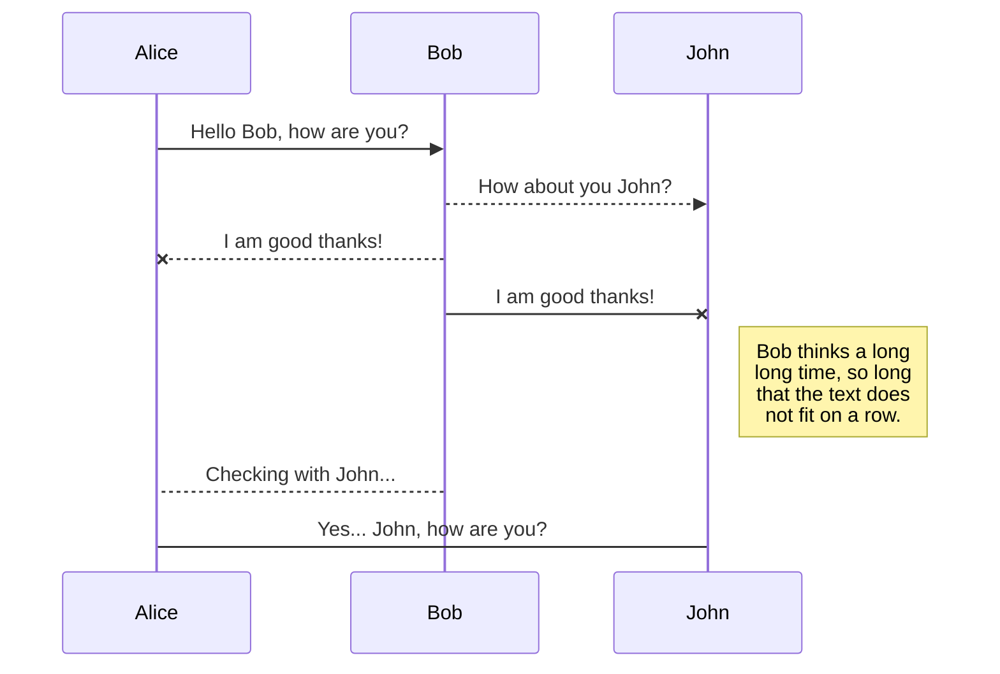
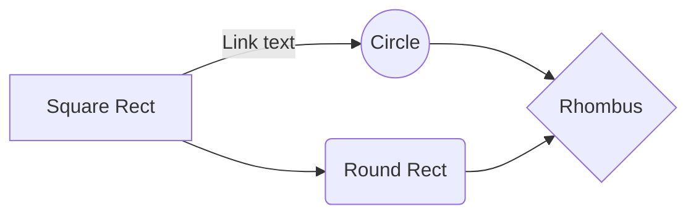

# hello-world-test-for-npm
This is hello world test program for npm repository.

# Header
  - This is also test markdown.

***hello***
The file explorer is accessible using the button in lef***t corner of*** the navigation bar. You can create a new file by clicking the **New file** button in the file explorer. You can also create folders by clicking the **New folder** button.

## UML diagrams

You can render UML diagrams using [Mermaid](https://mermaidjs.github.io/). For example, this will produce a sequence diagram:

And this will produce a flow chart:

